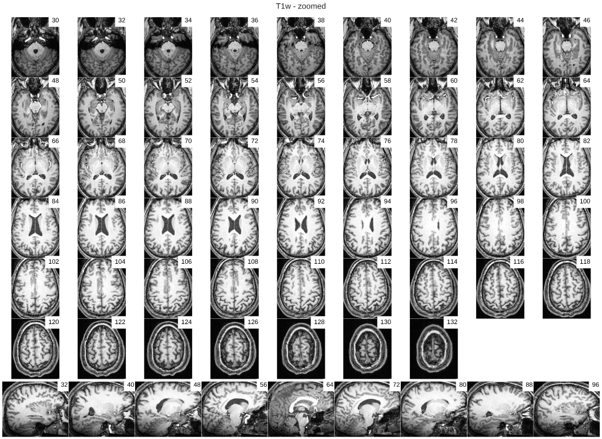
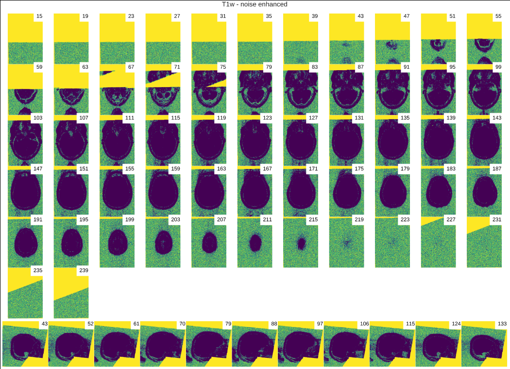

.. _interpreting:

=====================================
Interpreting the derivatives of MRIQC
=====================================
------------------------------------------------------------------
What to expect when you are expecting (for your images to be good)
------------------------------------------------------------------

This far, you probably :ref:`have successfully run MRIQC <running_mriqc>`
on your dataset.
At this point, you have two valuable classes of derivatives:
:ref:`a table of Image Quality Metrics (IQMs) <measures>` and
:ref:`the MRIQC visual reports <reports>`.
Let's leverage those outcomes and curate our dataset.

Using the :abbr:`IQMs (image quality metrics)`
==============================================

MRIQC extracts a number of :abbr:`IQMs (image quality metrics)`
that can be used as features in machine learning frameworks
to predict how a human would have rated the quality of each
MRI scan (e.g. `our paper <https://doi.org/10.1371/journal.pone.0184661>`_).

However, and according to our experience, these :abbr:`IQMs (image quality metrics)`
suffer from "batch effects" and require the harmonization of the features
across different scanning centers and parameters.
In other words, with the data we have collected so far we would expect a
performance in accuracy of about 78% for the internal MRIQC classifier in
a new (unseen) sample of T1-weighed images.

Since your dataset is likely different to those that were used in
training the classifier (available 
`here <https://doi.org/10.1371/journal.pone.0184661.t001>`_), then
you should expect MRIQC to make mistakes if you apply the 
:ref:`internal classifier <classifier>` directly on your dataset,
without :ref:`extending the training of it to your data <clfcustom>`.
For the case of functional MRI, MRIQC does not even provide a
pre-trained classifier.

In sum, the :abbr:`IQMs (image quality metrics)` are hard to interpret and
wildly unknown (in terms of their typical distributions or, at least,
some ranges of values and data moments).
For these reasons, we recently started the 
`MRIQC Web-API <https://doi.org/10.1101/216671>`_, a resource for scientist
to train new automatic classifiers.
We hope that crowdsourcing the :abbr:`IQMs (image quality metrics)` will
provide insights over the normative values of these metrics, calculate
confidence intervals and discover trends and relationships with metadata
such as scanning parameters, or the version of MRIQC.

Therefore the :abbr:`IQMs (image quality metrics)` may not be the most
useful tool for scientists to curate their datasets (yet).
In other words, MRIQC does not avoid (yet) the time consuming visual assessment
of all images in a sample.
For that reason, MRIQC generates :ref:`thorough visual reports <reports>` to
minimize the time it takes for an expert to asses an image.
The next step using MRIQC is revising all images of your sample individually.
Finally, we will propose some "shortcuts" for when the visual
inspection of every image is not possible.

Visual inspection of an MRI scan using the reports
==================================================

Assessing T1-weighted images
----------------------------

Let's look at `one example <http://web.stanford.edu/group/poldracklab/mriqc/reports/sub-50052_T1w.html>`_.
To assess the quality of participant with ID 50052 of `ABIDE <http://fcon_1000.projects.nitrc.org/indi/abide/>`_,
we open the report in our browser and scroll down to the "Visual Reports" section.

The "T1w - zoomed" plot
~~~~~~~~~~~~~~~~~~~~~~~

   This mosaic view shows every other axial slice of the dataset and also a few 
   sagittal cuts at the bottom, clipping in a bounding-box of the brain mask.

This is the one report that experts inspect more thoroughly, in search of:

  * Abnormal physiology to label incidental findings
  * Traces of head motion: parallel intensity ripples crossing the cortical sheet in anterior
    and posterior lobes. For example, a subtle presence of these ripples in our example,
    at the axial cut 102 suggest a moderate bulk-motion of the participant during scanning.
  * Traces of head motion and eyes movement: revealed by signal leakage from the eyeballs
    ghosting along the phase-encode direction of the scan.

    .. figure:: resources/howto-50805-T1w-eyeleakage.png

       Our example participant 50052 does not show clear eye motion spillover, however
       `participant 50805 <http://web.stanford.edu/group/poldracklab/mriqc/reports/sub-50805_T1w.html>`_
       shows this artifact.

  * Extreme :abbr:`INU (intensity non-uniformity)` derived from strong bias field or
    failures of receiving coils. Our example 50052 shows this problem in the posterior
    lobe and the cerebellum. The artifact is generally easier to spot in the coronal view.

  * Thermal noise, spike noise, and poor tissue (:abbr:`GM (gray matter)`/:abbr:`WM (white matter)`)
    contrast. Example 50052 shows a poor contrast, as compared to e.g.
    `participant 50805 <http://web.stanford.edu/group/poldracklab/mriqc/reports/sub-50805_T1w.html>`_).
    A different occurrence of poor tissue contrast (revealed as a blur effect) is shown by
    `participant 50603 <http://web.stanford.edu/group/poldracklab/mriqc/reports/sub-50603_T1w.html>`_.

  * Ferromagnetic, foreign materials may provoke signal loss and distortions (e.g. 
    `the second row of this figure <https://doi.org/10.1371/journal.pone.0184661.g001>`_).

  * Wrap-around sometimes may produce signal overlap from anterior to posterior and
    vice-versa. This effect is oftentimes accompanied by 
    :abbr:`FoV (field of view)` clipping (see 
    `this example <https://user-images.githubusercontent.com/238759/26985852-30e45880-4cfa-11e7-89f3-f5c509b88099.png>`_).

The "T1w - noise enhanced" plot
~~~~~~~~~~~~~~~~~~~~~~~~~~~~~~~

Some artifacts express at very low intensity levels and are only visible in the background
for the absence of signal of interest. Therefore, the background can be used as a baseline
of the noise and structured artifacts that are probably present across the object
of interest in the scan.

Additionally, bulk head motion is typically highlighted in this view. When this artifact
is present, it is generally easy to identify a rippling shades as a ghost of the
forehead and back of the cranium, in the air immediately surrounding the head.

Finally, some other undesired aspects can only visible with this view. For instance,
the rotation of the image information that is typically applied to align the AC-PC plane
and the axial plain of the image grid. This is a deterioration factor of the image
since it requires a resampling (re-gridding) of the image. It is generally preferable to
set an appropriate s/q-form matrix to the Nifti header.

   The T1-weighted image enhancing the background intensity ranges.

Additional plots generated using the ``--verbose-reports`` flag
~~~~~~~~~~~~~~~~~~~~~~~~~~~~~~~~~~~~~~~~~~~~~~~~~~~~~~~~~~~~~~~

Extra visualizations will be generated if MRIQC is run with the ``--verbose-reports`` flag.

Assessing :abbr:`BOLD (blood-oxygen level-dependent)` :abbr:`fMRI (functional MRI)` images
------------------------------------------------------------------------------------------

Shortcuts to inspecting all images
==================================

Demo: anatomical reports
------------------------

.. raw:: html

    <iframe height="380px" width="100%" src="https://mfr.osf.io/render?url=https://osf.io/w3p6d/?action=download%26mode=render" scrolling="yes" marginheight="0" frameborder="0" allowfullscreen webkitallowfullscreen></iframe>
    

Demo: functional reports
------------------------

.. raw:: html

    <iframe height="370px" width="100%" src="https://mfr.osf.io/render?url=https://osf.io/hrnvw/?action=download%26mode=render" scrolling="yes" marginheight="0" frameborder="0" allowfullscreen webkitallowfullscreen></iframe>
